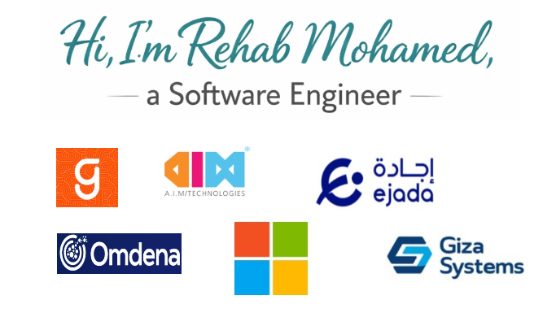

# Hello! 👋

Hi, I'm Rehab Mohamed Ahmed Lotfy, a passionate Computer Engineer dedicated to creating innovative solutions in software development, fullstack, machine learning, and cybersecurity.

---

## About Me 

- 🌱 I am currently exploring advanced projects in **AI-powered tools**, **web development**, and **malware analysis**.
- 👩‍💻 Specializing in developing **educational apps**, **e-commerce platforms**, and **security tools**.
- 🎓 Computer Engineering Student with a strong foundation in **algorithms**, **data structures**, and **system design**.

---

## Experience 

- **Freelance Developer**: Building responsive web applications and interactive tools.
- **Software Engineer at Omdena**: Worked on Fullstack projects.
- **Mentorship program at Microsoft**: Worked on Fullstack projects.
- **Intern at Geidea**: Worked on Fullstack projects.
- **Intern at Giza systems**: Worked on Fullstack projects.
- **Intern at EJADA**: Worked on backend projects.
- **Intern at ITI**: Worked on Fullstack projects.

---

## Skills 

- **Languages**: C++, Java , Python, JavaScript (Reactjs , Angular, Node.js) , C#
- **Frameworks & Libraries**: TensorFlow, Keras, Tkinter , .net , Springboot 
- **Database Management**: MongoDB, SQL
- **Tools**: Docker, Git, REST APIs

--- 

## Projects 

### **Static-Analysis-Tool**
A Python-based tool for analyzing PE files and performing malware scans using VirusTotal.
[Repository Link](https://github.com/rehabmohamed2/Static-Analysis-Tool)

### **E-Commerce_MEAN_Project**
A full-stack e-commerce web app built with the MEAN stack.
[Repository Link](https://github.com/rehabmohamed2/E-commerce_MEAN_Project)

### **Kids-Education-Voice-Recognition-App**
An interactive learning app powered by machine learning and voice recognition.
[Repository Link](https://github.com/rehabmohamed2/Kids-Education-Voice-Recognition-App)

---

## Contact 

- **GitHub**: [github.com/rehabmohamed2](https://github.com/rehabmohamed2)
- **LinkedIn**: [linkedin.com/in/rehab-mohamed](https://www.linkedin.com/in/rehab-mohamed-39a13a218/)
- **Email**: [rehab](mailto:rehabmohamed151220@gmail.com)

---

Let’s build something amazing together! 🌟

